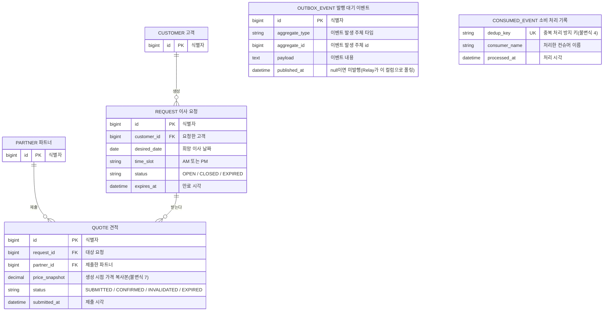

# ERD

슬롯 자리는 비워 둔다. `partner_slot_reservation` 같은 테이블은 슬롯 동시성 제어 방식이 결정된 뒤에만 확정한다. 지금 미리 그려두면 그 결정 검증 자체가 "이미 있는 테이블을 쓰는 작업"으로 바뀌어 의미가 없어진다. 인덱스도 아직 없다. 쿼리 패턴을 다 쓴 뒤에 붙인다.

mermaid 소스

## 표로 다시 보는 컬럼과 관계

### CUSTOMER

| 컬럼 | 타입 | 제약 | 설명 |
|---|---|---|---|
| id | bigint | PK | |

### PARTNER

| 컬럼 | 타입 | 제약 | 설명 |
|---|---|---|---|
| id | bigint | PK | |

### REQUEST

| 컬럼 | 타입 | 제약 | 설명 |
|---|---|---|---|
| id | bigint | PK | |
| customer_id | bigint | FK → CUSTOMER.id | |
| desired_date | date | | |
| time_slot | string | | `AM` 또는 `PM` |
| status | string | | `OPEN` / `CLOSED` / `EXPIRED` |
| expires_at | datetime | | |

### QUOTE

| 컬럼 | 타입 | 제약 | 설명 |
|---|---|---|---|
| id | bigint | PK | |
| request_id | bigint | FK → REQUEST.id | |
| partner_id | bigint | FK → PARTNER.id | |
| price_snapshot | decimal | | 생성 시점 가격 복사본(불변식 7) |
| status | string | | `SUBMITTED` / `CONFIRMED` / `INVALIDATED` / `EXPIRED` |
| submitted_at | datetime | | |

### OUTBOX_EVENT

| 컬럼 | 타입 | 제약 | 설명 |
|---|---|---|---|
| id | bigint | PK | |
| aggregate_type | string | | |
| aggregate_id | bigint | | |
| payload | text | | |
| published_at | datetime | nullable | null이면 미발행(Relay가 이 컬럼으로 폴링) |

### CONSUMED_EVENT

| 컬럼 | 타입 | 제약 | 설명 |
|---|---|---|---|
| dedup_key | string | UK | 불변식 4 |
| consumer_name | string | | |
| processed_at | datetime | | |

### 관계

| 부모 | 자식 | 관계 | 설명 |
|---|---|---|---|
| CUSTOMER | REQUEST | 1:N | 한 고객이 여러 요청을 만든다 |
| PARTNER | QUOTE | 1:N | 한 파트너가 여러 견적을 제출한다 |
| REQUEST | QUOTE | 1:N | 한 요청에 여러 견적이 붙는다 |

## 엔티티별 메모

- **Customer / Partner**: 인증 범위 밖(`docs/decisions/01_인증_범위_제외.md`)이라 최소 컬럼만 둔다. Request/Quote의 소유자를 가리키는 식별자 수준.
- **Request**: 생명주기: `OPEN → CLOSED`(자신의 Quote 중 하나가 CONFIRMED) 또는 `OPEN → EXPIRED`(만료 시각 도달, 확정 없음). 되돌아가는 화살표 없음. CLOSED가 가리키는 확정 Quote는 하나뿐이어야 한다(불변식 8). EXPIRED로 옮기는 주체는 이번 범위에서 만들지 않는다(`decisions/07_만료_처리_범위_제외.md`). 만료 여부는 상태값을 보는 대신 `expires_at`과 현재 시각을 비교해 판정한다. 취소(CANCELLED) 상태도 두지 않는다. 확정 후 취소와 취소 후 견적 복원이 범위 밖이라 이 모델에 표현할 전이가 없다.
- **Quote**: 생명주기: `SUBMITTED → CONFIRMED`(고객이 확정) 또는 `SUBMITTED → INVALIDATED` 또는 `SUBMITTED → EXPIRED`. INVALIDATED로 가는 경우는 두 가지다. 같은 슬롯의 다른 Quote가 CONFIRMED됐을 때(파트너가 그 시간에 다른 집으로 가게 됨), 그리고 같은 요청의 다른 Quote가 CONFIRMED됐을 때(고객이 다른 파트너를 고름). 둘 다 이후 전이가 없는 종착 상태라 상태는 하나로 둔다. 어느 쪽으로 무효화됐는지는 컬럼 없이 무효화 이벤트 페이로드에만 싣는다. 지금 그 사유를 읽는 곳이 파트너 알림뿐이고, 알림은 이벤트를 받아서 만든다. 취소 후 복원을 실제로 설계할 때 사유별로 다음 전이가 달라지면 컬럼이나 상태 분리를 다시 본다. Request와 마찬가지로 EXPIRED 전이 주체는 이번 범위에 없다. `@Version` 컬럼 필요 여부는 불변식 1과 8의 계층이 정해진 뒤 결정한다. 낙관적 락은 두 불변식의 공통 후보라 한쪽만 보고 정할 수 없다. 지금은 넣지 않는다.
- **OutboxEvent**: 불변식 2·3을 지키는 테이블. `published_at`이 null인 로우만 Relay가 재시도 대상으로 본다.
- **ConsumedEvent**: 컨슈머 쪽 dedup 기록. `dedup_key`에 UNIQUE 제약(불변식 4). 실제 처리 결과(예: Notification insert)와 이 로우의 insert가 같은 트랜잭션에 있어야 한다(불변식 5). ERD는 이 트랜잭션 경계를 표현하지 못하므로 `docs/wiki/flow/`에서 별도로 다룬다.
- **슬롯**: 이 ERD에 없다. `(partner_id, desired_date, time_slot)` 조합이 Quote/Request 컬럼으로 대체 가능한 값인지, 별도 로우가 필요한지는 불변식 1의 계층을 정하는 과정에서 정한다.
